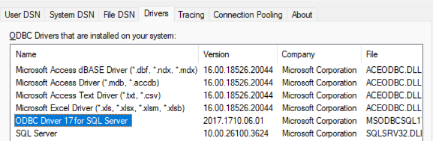

# Chỉnh sửa file config
SQLALCHEMY_DATABASE_URI = ("mssql+pyodbc://@localhost\\SQLEXPRESS/EXAM_REGISTER"
        "?driver=ODBC+Driver+17+for+SQL+Server"
        "&trusted_connection=yes")

# Cập nhật phần localhost
Bước 1: Mở SSMS

Bước 2: Nhìn ngay khung đăng nhập:

Server name: chính là localhost\SQLEXPRESS hoặc DESKTOP-ABC123\SQLEXPRESS

# Cập nhật bản ODBC
Bước 3: 
-- Mở Control Panel

-- Gõ "ODBC" vào ô tìm kiếm → chọn ODBC Data Sources (64-bit)

-- Vào tab Drivers

-- Tìm dòng nào có SQL Server như:

(Tùy vào mỗi máy sẽ là 17/18)